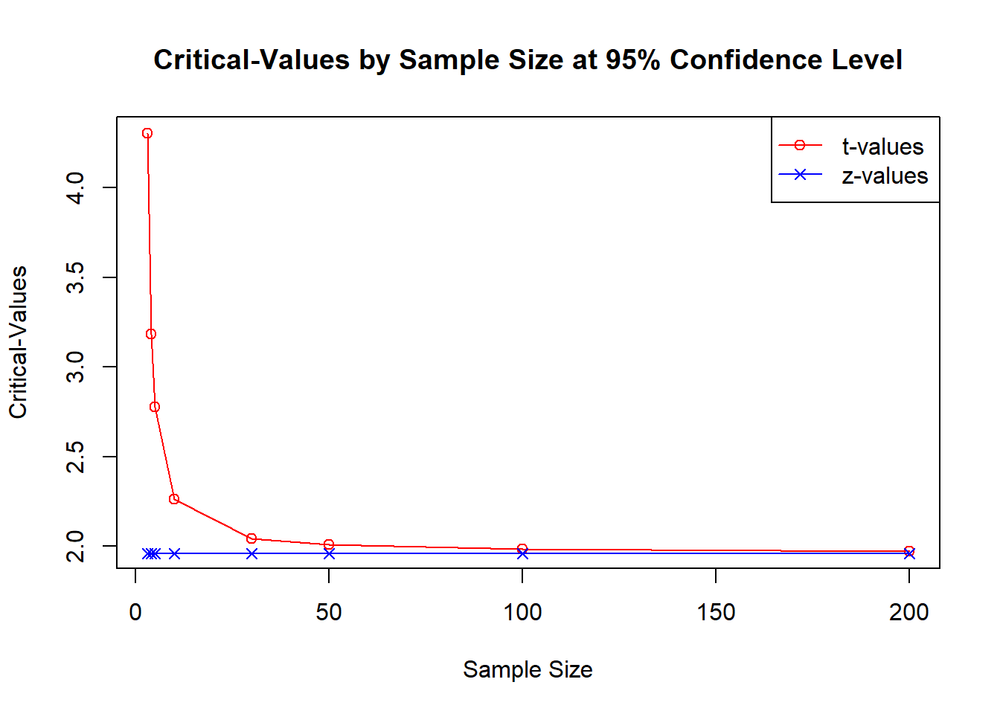
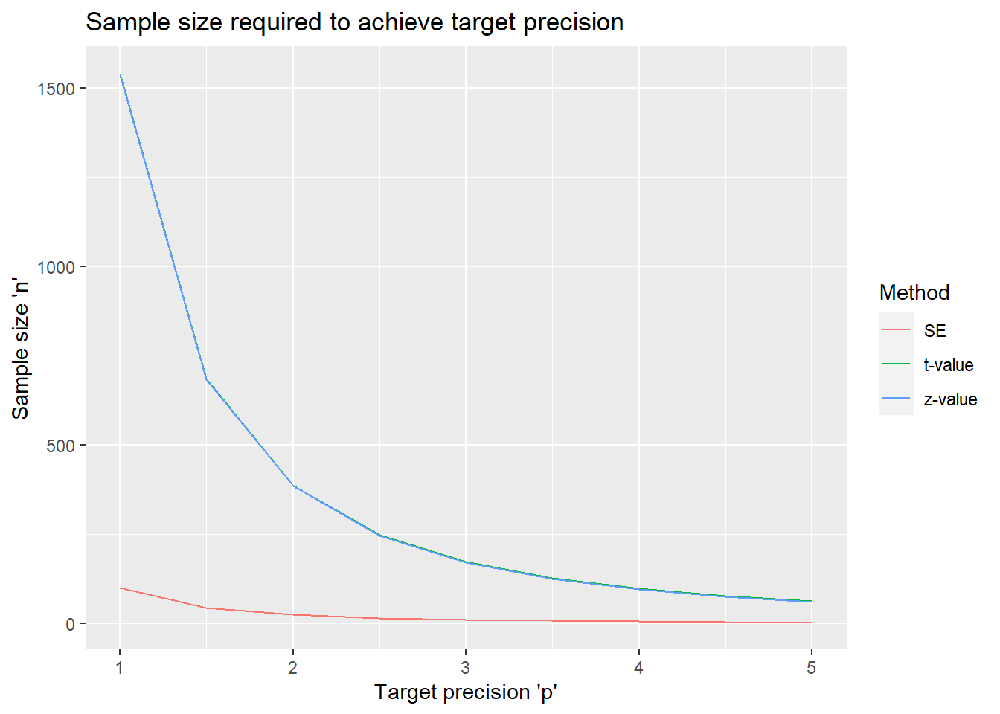

# One-sample mean: precision-based sample size

Co-author: Alyssa Bivens 

## Example

The [Patient-Reported Outcomes Measurement Information System (PROMIS)](https://www.healthmeasures.net/explore-measurement-systems/promis) provides validated questionnaires for a wide range of quality-of-life outcomes in the domains of physical, mental, and social health. The responses from a subject are summarized with a T-score, which has a mean 50 and standard deviation of 10 in the US general population.

An investigator wants to study anxiety in the population of patients with cyclic vomiting syndrome (CVS) using the PROMIS Anxiety scale to see if they report more anxiety (ie higher T-scores on the scale) than the general population. How many subjects are needed?

## Data generating mechanism

Independently identically distributed observations $X_1, \ldots, X_n$ with mean $\mu$ and standard deviation $\sigma$, with $\mu$ being the parameter of interest. The population mean $\mu$ is estimated by the sample mean $\bar{X}_n$ =
$\frac{\sum(X_i)}{n}$. 


## Precision measures

### Standard error

To calculate standard error (SE) or sample size (n) from standard error,
it is $\underline{not}$ required for the underlying distribution to be normal.

The standard error of sample mean  is
$SE(\bar{X}) = \frac{\sigma}{\sqrt{n}}$.

Solving for $n$, we have $$n= \frac{\sigma^{2}}{SE^2},$$ where SE is the targeted
standard error of the estimate.


```r
#'Calculate standard error for given sample size, or vice versa. Exactly one of 'n' and 'se' has to be NULL

#'sd - expected standard deviation
#'n - sample size 
#'se - standard error of estimated mean

se_mean <- function (sd, n=NULL, se=NULL)  {
  if(is.null(n) & !is.null(se))   {
    (n<-(sd^2)/se^2)
  } else if (!is.null(n) & is.null(se)){
    (se <- sd/sqrt(n))
  } else stop("Exactly one of 'n' and 'se' has to be NULL; 'sd' must be known")

  res <- list (n = n, sd = sd, se = se)
  res
  }
```


### Confidence Interval

Another way to quantify the precision of the estimated mean is the width
of the resulting two-sided confidence interval, usually at a 95%
confidence level. The half of the width of a symmetric 95% confidence
interval is also called the margin of error. There are two methods for
estimating a confidence interval for a mean, which result in symmetric
intervals. We can use the $z$-based interval if the population standard deviation
($\sigma$) is known, and the $t$-based confidence interval if $\sigma$ is
unknown.

The confidence intervals are computed under the assumption that the data are
normally distributed. However, according to the central limit theorem,
with a sufficiently large sample size $n$, the sample mean $\bar{X}_n$
will be normally distributed regardless of the population distribution.

The $100(1-\alpha)$% confidence interval for $\mu$ when $\sigma$ is known is
$CI = \bar{X} \pm z_{\frac {\alpha}{2}}\frac{\sigma}{ \sqrt n}$.

The confidence interval when $\sigma$ is unknown is
$CI = \bar{X} \pm t_{\frac{\alpha}{2}, n-1}\frac{s}{\sqrt n},$

where $t_{\frac {\alpha}{2}, n-1}$ is the upper $\frac{\alpha}{2}$th quantile of the $t$-distribution with $n-1$ degrees of freedom, and $s$ is the sample standard deviation.

To understand the difference between the $z$-based interval and $t$-based
interval, consider the following graph:


```r
sample_sizes <- c(3, 4, 5, 10, 30, 50, 100, 200)

df <- c(sample_sizes - 1)
t_values <- qt(p=.05/2, df = df, lower.tail = FALSE)

z <- qnorm(p=.05/2, lower.tail=FALSE)

xy <- data.frame(n = sample_sizes, 
                 t = t_values,
                 z = z)

plot (xy$n, xy$t, type='o', col = 'red',
      xlab = "Sample Size", ylab = "Critical-Values", 
      main = "Critical-Values by Sample Size at 95% Confidence Level")
points(xy$n, xy$z, col='blue', type="o", pch=4)
legend("topright", legend = c("t-values", "z-values"), col=c("red", "blue"), 
       pch=c(1,4), lty=1)
```



The red line represents the $t$ critical values associated with various
sample sizes; the blue line represents the constant value of 1.959964,
which is the $z$ critical value. We can see that as the the sample size increases, the $t$ critical value approaches the $z$ critical value. The difference becomes small by a sample size of 30, which is the typically quoted cutoff for using the asymptotic test. The difference is barely noticeable after a sample size of 100. Overall, this shows that, in many instances, the difference
between using a $t$ critical-value and using a $z$ critical-value is
negligible.

The `prec_mean` function in ``{presize}`` provides the sample size calculation for the $t$-based confidence interval.


```r
library(presize)
str(prec_mean)
```

```
## function (mean, sd, n = NULL, conf.width = NULL, conf.level = 0.95, ..., 
##     mu = NULL)
```

Note that the formulas above imply that the `mean` is a superfluous parameter, and can be set to any value. For completeness, the following function implements a $z$-based computation.


```r
# Function that can find the n or conf.width based on what is null.
prec_mean_z <- function (sd, n = NULL, conf.width = NULL, conf.level=.95) {
  alpha <- (1-conf.level)/2
  z <- qnorm(alpha, lower.tail = FALSE)

  if(is.null(conf.width) & !is.null(n)) {
  ci<- (z*(sd/sqrt(n)))
  conf.width <- 2 * ci
res <- list (sd = sd, n = n, conf.width = conf.width, conf.level = conf.level)
res
  }

  else if(!is.null(conf.width) & is.null(n)) {
  ci <- conf.width/2
  n <- ((sd*z)/ci)^2
  }
  
  else stop ("Exactly one of 'n' and 'conf.width' must be NULL")

  res <- list (sd = sd, n = n, conf.width = conf.width, conf.level = conf.level)
res }
```


## Simulation study


```r
# Write function to get n
solve_n <- function (precision, sd, conf.level=.95, n = NULL, method = c("SE", "t-value", "z-value"))
{
  method <- match.arg(method, choices = c("SE", "t-value", "z-value"))

  if (method == "SE")
    {
    n <- se_mean(sd = sd, n = NULL, se = precision)$n
  }
   
  
  else if(method == "z-value")
    {
    n <- prec_mean_z(sd = sd, n = NULL, conf.width = precision, conf.level = conf.level)$n
  }
  

    else if(method == "t-value")
  {
  n <- prec_mean (mean = 0, conf.width = precision, conf.level = conf.level, sd = sd)$n
}
  
  
  else stop ("'method' must be 'z', 't', or 'SE'")
  
  n <- ceiling(n)
  return(n)
}


#Find n based on various sd, method, or, p.

## set vector of precision values (p0) and methods (m0) to explore
p0 <- seq(1, 5, by=.5)
sd0 <- 10
m0 <- c("SE", "t-value", "z-value")
# Data set with varying 'mean' and 'w'
se_settings <- expand.grid(p = p0, sd = sd0, m = m0, stringsAsFactors = FALSE)

# Apply the sim mean functions to all possibilities like se_settings
se_settings$n <- sapply(1:nrow(se_settings), function(idx) with (se_settings, solve_n (precision = p[idx], sd = sd[idx], method = m[idx])))


library(ggplot2)
ggplot(se_settings, aes(x = p, y = n, color = m, group = m)) +
  geom_line()+
  scale_color_discrete("Method") +
  xlab("Target precision 'p'") +
  ylab("Sample size 'n'") +
  ggtitle("Sample size required to achieve target precision")
```



Graph various simulated precision's for various methods, distributions,
and target precisions.


```r
#  set up possible values for target precision, standard deviation, method, and distribution.
p0 <- seq(1, 5, by=.5)
sd0 <- 10
m0 <- c("SE", "t-value", "z-value")
d0 <- c("normal", "uniform", "exp")

sim_settings <- rbind(
  expand.grid(
  sd = sd0,
  p = p0,
  method = m0, stringsAsFactors = FALSE,
  distribution = d0),
  expand.grid(
    sd = sd0,
  p = p0,
  method = m0, stringsAsFactors = FALSE,
  distribution = d0
  ))
# Allow function to be used from presize
library(presize)
# Create a function to calculate the simulated precisions.
sim_mean <- function (sd, n=NULL, conf.level = .95, precision, R = 1000, method = c("SE", "t-value", "z-value"), distribution = c("normal", "uniform", "exp"))  
{
  
# Allow variants of SE, t-value, and z-value; prevent non-characters from being allowed.
  method <- match.arg(method, choices = c("SE", "t-value", "z-value"))
  
# Find sample size (n) depending on method.
  if (method == "SE")
  {
    n<-(sd^2)/precision^2
  }
  else if(method == "z-value")
    {
    alpha <- (1-conf.level)/2
  z <- qnorm(alpha, lower.tail = FALSE)
   ci <- precision/2
  n <- ((sd*z)/ci)^2
  }
  else if(method == "t-value")
  {
  n <- prec_mean (mean = 0, conf.width = precision, conf.level = conf.level, sd = sd)$n
  }
else stop ("'method' must be 'z', 't', or 'SE'")
  
# Round n up to nearest interger.
  n <- ceiling(n)

#Simulate possible outcome with the predicted SD and the predicted n and various distributions.
  if (distribution == "normal")
se_vec <- replicate (R, {x <- rnorm(n = n, mean = 0, sd = sd); sd_x = sd(x); sd_x/sqrt(n)})
  
  if (distribution == "uniform")
  se_vec <- replicate (R, {x <- runif(n = n, min = 0, max = sd*sqrt(12)); sd_x = sd(x); sd_x/sqrt(n)})
  ## To use the runif function the min and max must be calculated in relationship to standard deviation*.
  
    
  if (distribution == "exp")
  se_vec <- replicate (R, {x <- rexp(n = n, rate = 1/sd); sd_x = sd(x); sd_x/sqrt(n)})
  ##To use the rexp function the rate must be calculated in relationship to standard deviation**.
  
if (method == "t-value")
      {
      t_value <- qt(p= (1 - conf.level)/2, df = n - 1, lower.tail = FALSE)
      t_ci <- 2*(t_value*se_vec)

}
  if (method == "z-value")
  {
    z_value <- qnorm (p = (1 - conf.level)/2, lower.tail = FALSE)
    z_ci <- 2*(z_value*se_vec)
    }

if (method == "SE")
{
  precision_dataframe <- data.frame(sd = sd, n = n, method = "SE", distribution = distribution, precision = se_vec, target = precision)
}
if (method == "t-value")
{
  precision_dataframe <- data.frame(sd = sd, n = n, method = "t-value", distribution = distribution, precision = t_ci, target = precision)
}
if (method == "z-value")
{
  precision_dataframe <- data.frame(sd = sd, n = n, method = "z-value", distribution = distribution, precision = z_ci, target = precision)
}
return(precision_dataframe)  
}

#Run simulation for each value of the grid:
set.seed(12345)
sim_list <- lapply (1:nrow(sim_settings), 
              function(idx) with (sim_settings, 
                                  sim_mean(precision = p[idx], sd = sd0, 
                                        method = method[idx], distribution = distribution[idx], R = 1000)))
sim_res <- do.call(rbind, sim_list)
# Graph sim_res
library(ggplot2)

ggplot(sim_res, aes (x=target, y = precision, color = factor(method))) +
  facet_grid(method~distribution, scales = "free_y") +
  geom_boxplot(aes(group=interaction(method, distribution, target)), outlier.size = 1, outlier.alpha = 0.025) +
    scale_color_discrete("Targeted precision") +
  geom_abline(intercept = 0, slope = 1)
```


Notes

 * In the uniform distribution $\frac{1}{\sqrt{12}}(b-a) = sd$ where b
is the maximum, a is the minimum, and sd is the standard deviation.
Because we only need to know the range, we can assign a value to a and
solve it in relationship to b. Therefore, we can assign a (the minimum)
as 0 and solve for b (the maximum). After solving for the maximum (b),
we calculate that $b = sd*\sqrt{12}$.

 *  In the exponent distribution $sd = \frac{1}{\lambda}$, where
$\lambda = rate$. Therefore solving for rate, we calculate that
$\lambda = \frac{1}{sd}$.

## Getting inputs

### Estimating Standard Deviation

To estimate n from sample error (or vice versa), standard deviation must
be either known or estimated. Some ways to obtain an already known
standard deviation, include researching standard deviations obtained
from similar studies or using a universal, known standard deviation
(depending on the type of study).

If standard deviation cannot be obtained in this way, it must be
estimated. Use information known about the value being collected to
estimate an approximate minimum value collected and an approximate
maximum value. For example, height of adults can have an estimated
minimum collected value of 4 ft and 9 inches and estimated maximum
collected value of 6 feet and 2 inches. While there are adults with
heights below 4 feet and 9 inches and above 6 feet and 3 inches, they
are very uncommon and therefore (by probability) not likely to be in the
sample. Ideally, this will give a range close to the range of the data
collected.

After a range is estimated, we can then us a formula called the range
rule for standard deviation which states the following:

sd $\approx \frac{max-min}{4}$ where sd = standard deviation, max =
estimated maximum value, and min = estimated minimum value.


```r
#' Calculate sample standard deviation for a given range. There must be exactly one one 'max' and one 'min.'
#' sd = standard deviation
#'  max = estimated maximum value
#'  min = estimated minimum value

sd_from_range <- function (max=max, min=min, sd=NULL) {
sd <- (max - min)/4
return(sd)
}
```

## Example revisited

As stated in the example, we want to calculate the sample size (n) based
on a t-score method and a claimed standard deviation of 10.
Additionally, we know the mean is 50, but this is an unnecessary fact
for calculating n. Since we are only finding the sample size, we would
use the solve_n function created earlier. In order to find n, we need
standard deviation, precision, and a chosen confidence level.

The example gives us a known standard deviation of 10. To estimate
precision, we can use other studies with similar studies and use what
was obtained in them or use studies that determine minimally important
differences (MIDs). For example, in this study we can use a study from
the National Library of Medicine titled "estimating minimally important
differences for the PROMIS pain interference scales: results from 3
randomized clinic trials" to determine an approximate minimally
important differences (Source 1). Using the data, we can estimate a
minimum importance difference (MID) of around 3 (Source 1), which means
that in order to get the confidence width (or precision), which
calculates the likelihood of it being outside of the acceptable range on
both sides of the target value would be to multiply the approximate MID
by 2. Therefore, the precision for this example is 6.

$$
MID*2 = precision
$$

Choose a confidence level based on preference. In this case, we can
choose a 95 percent confidence level.

Since we have a n of 46 calculated from the solve_n function, the
minimal sample size is 46.


```r
solve_n(precision = 6, sd =10, method = "t-value")
```

```
## [1] 46
```

In conclusion, we can state the following:

Assuming the standard deviation of 10, with 46 patients the mean PROMIS
questionnaire scores can be estimated with a precision not exceeding a
width of 6 points on a 95% confidence level (margin of error of 3
points).

1)  <https://pubmed.ncbi.nlm.nih.gov/29200181/#&gid=article-figures&pid=figure-1-uid-0>

## Functions in R packages
