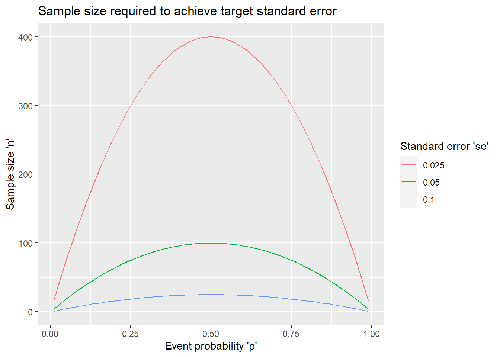
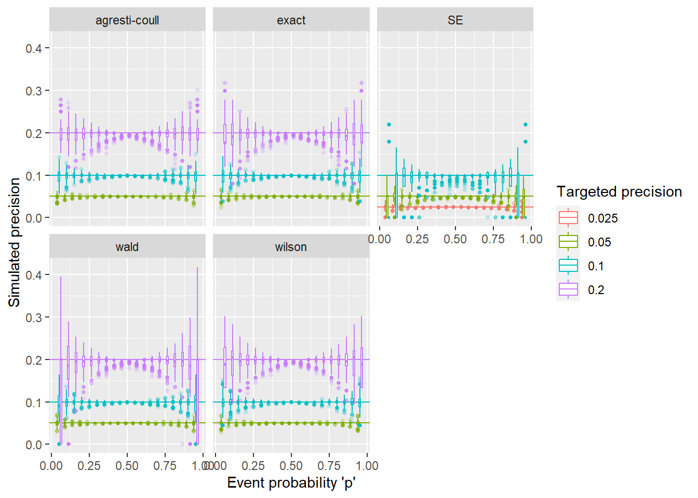

# One-sample proportion: precision-based sample size

## Example

An educator wants to conduct a survey of first-year medical residents. The survey contains yes/no questions for several specific medical procedures asking whether they would be comfortable performing it without the presence of an attending physician. How many residents should he recruit?

## Data generating mechanism

Independent identically distributed variables $X_1, \ldots, X_n \sim Bernoulli(p)$ with $p$, the event probability as the parameter of interest.

It will be estimated as the sample proportion $\hat{p} = \sum_{i=1}^n X_i / n$. Inference can be based on the exact distribution of $X = \sum_{i=1}^n X_i \sim Binom(n,p)$ or the asymptotic distribution of $\hat{p} \sim N(p, \frac{p(1-p)}{n})$.

## Precision measures

### Standard error

The standard error of $\hat{p}$ is

\begin{equation}
SE(\hat{p}) = \sqrt\frac{p(1-p)}{n}. 
\end{equation}

Solving for $n$, we have
\begin{equation}
n = \frac{p(1-p)}{SE^2}, 
\end{equation}
where $SE$ is the targeted standard error of the estimate.


```r
#' Calculate standard error for given sample size, or vice versa. Exactly one of 'n' and 'se' has to be NULL
#' p - expected event probability
#' n - sample size
#' se - standard error of estimated probability
se_prop <- function(p, n=NULL, se=NULL){
  if (is.null(n) & !is.null(se)){
    n <- p * (1-p) / se^2
  } else if (!is.null(n) & is.null(se)){
    se <- sqrt(p*(1-p)/n)
  } else stop("Exactly one of 'n' and 'se' has to be NULL")
  
  res <- list(p = p, n = n, se = se)
  res
}
```

### Confidence interval 

Another way to quantify the precision of the estimated proportion is the width of the resulting two-sided confidence interval, usually at a 95% confidence level. The half of the width of a symmetric 95% confidence interval is also called the _margin of error_. There are several methods for estimating a confidence interval for a proportion, most of which resulting in non-symmetric intervals.

**Confidence interval methods**

| Method          | $100(1-\alpha)$% confidence interval | 
|:---------------|:-------------------------------------:|
| Wald           | $\Big(\hat{p} \pm z_*\sqrt{\frac{\hat{p}(1-\hat{p})}{n}}\Big)$|
| Wilson         | $\Big(\hat{p}_{adj} \pm \frac{z_*}{1+z_*^2/n} \sqrt{\frac{\hat{p}(1-\hat{p})}{n} + \frac{z_*^2}{4n^2}}\Big)$|
| Exact binomial | $(b_{1-\frac{\alpha}{2}; n,\hat{p}}; b_{\frac{\alpha}{2}; n,\hat{p}})$|
| Agresti-Coull  |$(\hat{p}_{adj} \pm z_*\sqrt{p_{adj}(1-p_{adj})/n})$

where $\hat{p}_{adj} = \frac{X + 0.5z_*^2}{n + z_*^2}$, $b_{\frac{\alpha}{2}; n,p}$ is the upper $\frac{\alpha}{2}$th quantile of the $Binomial(n,p)$ distribution, $z_* = z_\frac{\alpha}{2}$ denotes the upper $\frac{\alpha}{2}$th quantile of the standard normal distribution, and $(a \pm d)$ is a shorthand for a symmetric confidence interval $(a-d, a+d)$ with margin of error $d$.

Base R implements the Wilson (`prop.test` when used with `correct=FALSE`) and the exact (`binom.test`) confidence intervals. The other intervals are available in packages, eg the `binom` package.[@R-binom]

The calculation of the sample size `n` or the confidence interval width is implemented in the `presize` R package. [@R-presize; @presize2021]


```r
library(presize)
str(prec_prop)
```

```
## function (p, n = NULL, conf.width = NULL, conf.level = 0.95, method = c("wilson", 
##     "agresti-coull", "exact", "wald"), ...)
```


## Getting inputs, worst/best case scenarios

The inputs needed to calculate the sample size are 
  * a best guess at $p$, the proportion to be estimated
  * the target precision defined as the standard error or confidence interval width
  
The following plot shows how the sample size depends on these inputs:   


```r
# set vector of 'p' & 'se' values to explore
p0 <- seq(0.01, 0.99, by=0.01)
s0 <- c(0.1, 0.05, 0.025)
# Data set with varying 'p' and 'se'
se_settings <- expand.grid(p = p0, se = s0)
# Calculate 'n' for each combination
se_settings <- transform(se_settings, n = se_prop(p=p, se=se)$n)

library(ggplot2)
ggplot(se_settings,
       aes(x = p, y = n, color = factor(se), group = se)) +
  geom_line() +
  scale_color_discrete("Standard error 'se'") +
  xlab("Event probability 'p'") +
  ylab("Sample size 'n'") +
  ggtitle("Sample size required to achieve target standard error")
```




```r
# set vector of CI width values and CI methods to explore
w0 <- c(0.2, 0.1, 0.05)
m0 <- c("agresti-coull","wald", "wilson","exact")
# Data set with varying 'p' and 'w'
ci_settings <- expand.grid(p = p0, w = w0, Method=m0, stringsAsFactors = FALSE)
# Calculate 'n' for each combination
# prec_prop is not vectorized for this calculation
ci_settings$n <- sapply(1:nrow(ci_settings),
                    function(idx) with(ci_settings, 
                                       prec_prop(p=p[idx], 
                                                 conf.width = w[idx],
                                                 method = Method[idx])$n))

ggplot(ci_settings,
       aes(x = p, y = n, color = factor(w), linetype = Method, 
           group = interaction(w, Method))) +
  geom_line() +
  scale_color_discrete("95% CI width 'w'") +
  xlab("Event probability 'p'") +
  ylab("Sample size 'n'") +
  ggtitle("Sample size required to achieve target width of 95% CI") 
```


The following is evident from the plots (and the binomial variance formula):

 * The largest sample size is needed for $p=0.5$. If there is no a-prior information about the expected event probability, using the worst-case value of $p=0.5$ in the calculations ensures that the target precision is reached (or exceeded) regardless of the true value.
 
 * The required sample size decreases as we move away from $p=0.5$ toward either end of the range. So if we can bound that expected event probability away from 0.5, ie $p < p_L < 0.5$ or $p > p_H > 0.5$, then we can use $p_L$ or $p_H$ in the calculations, and ensure that the target precision is reached (or exceeded) for any true value below $p_L$ (or above $p_H$).
 
  * The exact confidence interval method requires the largest sample size. The other methods give very similar results unless $p$ is very close to 0 and 1.


## Simulation study

The simulation studies are set up to show how the actual confidence interval widths vary from the target values using the 'n' values computed above.


```r
library(binom)
# create simulation settings with fewer values for 'p' than in the plot 
sim_settings <- rbind(
  expand.grid(p = seq(0.05, 0.95, by=0.05),
              precision = s0,
              method = "SE", 
              stringsAsFactors = FALSE),
  expand.grid(p = seq(0.05, 0.95, by=0.05),
              precision = w0,
              method = m0, 
              stringsAsFactors = FALSE))

# function that, given 'p', method and planned sample size, simulates data 'R' times and 
# computes the relevant confidence interval width
# output is data frame with one row per simulation
sim_se_ci <- function(precision, p, method, R=1000){
  if (method == "SE"){
    n <- se_prop(p=p, se=precision)$n
  } else {
    n <- prec_prop(p=p, conf.width=precision, method = method)$n
  }
  
  # round up
  n <- ceiling(n)
  
  # simulate data as binomial sum
  x <- rbinom(R, size=n, prob=p)
  
  if (method == "SE"){
    phat <- x/n
    se <- sqrt(phat * (1-phat) / n)
    res <- data.frame(p = p, target = precision, method = "SE", n=n, precision = se)
  } else {
    bmeth <- if (method=="wald") "asymptotic" else method
    df <- binom.confint(x=x, n=n, methods=bmeth)
    res <- data.frame(p = p, target = precision, method = method, n=n, 
                 precision = df$upper - df$lower)
  }
  res
}

# run simulation for each value of the grid
set.seed(20576)
sim_list <- lapply(1:nrow(sim_settings),
                   function(idx) with(sim_settings,
                                      sim_se_ci(precision = precision[idx], 
                                                p = p[idx],
                                                method=method[idx])))
sim_res <- do.call(rbind, sim_list)
```


```r
ggplot(sim_res, aes(x=p, y=precision, color = factor(target))) +
  facet_wrap(~method) +
  geom_hline(aes(yintercept = precision, color=factor(precision)), data=sim_settings) +
  geom_boxplot(aes(group=interaction(p, target)), outlier.size = 1, outlier.alpha = 0.2) +
  scale_color_discrete("Targeted precision") +
  xlab("Event probability 'p'") +
  ylab("Simulated precision")
```




## Example revisited 

## Functions in R packages

