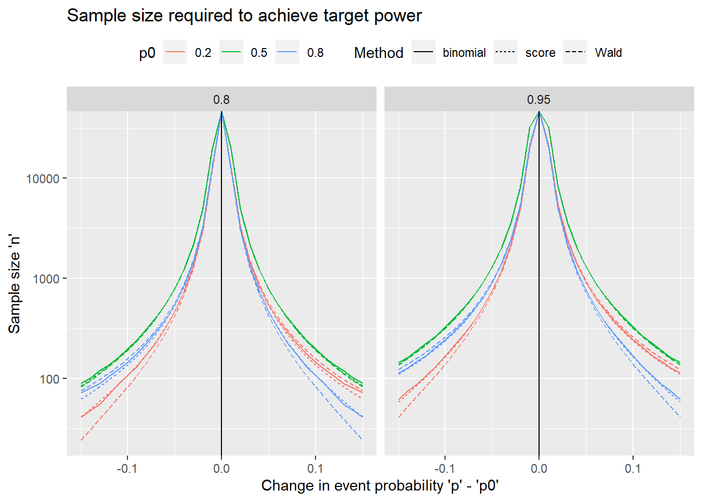

# One-sample proportion: power-based sample size

## Example

An oncologist is developing a new treatment, and he wants to run a single arm phase II study to estimate the probability of response (partial or complete reduction in the size of the tumor) after four weeks of treatment. The current standard of care has a 30% response probability. How many subjects should he recruit?

## Data generating mechanism

Independent identically distributed variables $X_1, \ldots, X_n \sim Bernoulli(p)$ with $p$, the event probability as the parameter of interest.

It will be estimated as the sample proportion $\hat{p} = \sum_{i=1}^n X_i / n$. Inference can be based on the exact distribution of $X = \sum_{i=1}^n X_i \sim Binom(n,p)$ or the asymptotic distribution of $\hat{p} \sim N(p, \frac{p(1-p)}{n})$.

## Power-based sample size

The sample size can also be based on the power to test, at a significance level $\alpha$, the null hypothesis $H_0: p = p_0$ versus the two-sided alternative $H_{a1}: p \neq p_0$, or the one-sided alternatives  $H_{a2}: p > p_0$ or  $H_{a3}: p < p_0$.

### Test statistic {-}

There are three commonly used tests:

 1. **Exact binomial test** with test statistic  $X = \sum_{i=1}^n X_i \sim Binom(n,p_0)$ under $H_0$
 2. One-sample **Wald z-test** with test statistic  $Z_W = \frac{\hat{p} - p_0}{\sqrt{\hat{p}(1-\hat{p})/n}} \approx N(0,1)$ under $H_0$
 3. One-sample **Score z-test** with test statistic  $Z_S = \frac{\hat{p} - p_0}{\sqrt{p_0(1-p_0)/n}} \approx N(0,1)$ under $H_0$
 
**Rejection regions for the tests**

| Test           | $H_{a1}: p \neq p_0$ | $H_{a2}: p > p_0$ | $H_{a3}: p < p_0$ |
|:---------------|:--------------------:|:-----------------:|:-----------------:|
| Exact binomial | $X \geq b_{\frac{\alpha}{2}; n,p_0}$ or $X \leq b_{1-\frac{\alpha}{2}; n,p_0}$ | $X \geq b_{\alpha; n,p_0}$ | $X \leq b_{1-\alpha; n,p_0}$ |
| Wald z-test    | $|Z_W| \geq z_\frac{\alpha}{2}$ | $Z_W \geq z_\alpha$ |  $Z_W \leq -z_{\alpha}$ |
| Score z-test   | $|Z_S| \geq z_\frac{\alpha}{2}$ | $Z_S \geq z_\alpha$ |  $Z_S \leq -z_{\alpha}$ |
 
where $b_{\alpha; n,p_0}$ is the upper $\alpha$th quantile of the $Binomial(n,p_0)$ distribution, and $z_{\alpha}$ is the upper $\alpha$th quantile of the $N(0,1)$ distribution.

The exact binomial test is implemented in R in `binom.test`, the Wald test in `prop.test` (with or without continuity correction). The score test is not implemented in base R. The following function implements them in a unified framework to simplify the simulation study.


```r
one_prop_test <- function(x, n, p0, method = c("binomial", "Wald","Score")){
  
}
```


### Power formula {-}

The power for a specific alternative $p=p_1$ are shown for the one-sided alternative hypothesis $H_{a2}$. The formula for $H_{a3}$ is a straightforward modification, while the power for the two-sided hypothesis is the sum of the powers for the two one-sided hypotheses using $\alpha/2$ instead of $\alpha$.

**Power for the tests**

| Test           | Prob(rejecting $H_0$ versus $H_{a2}$) | 
|:---------------|:-------------------------------------:|
| Exact binomial | $1 - F_{B(n,p_1)}(b_{\frac{\alpha}{2}; n,p_0})$|
| Wald z-test    | $1 - \Phi\Big(z_\alpha - \frac{p_1 - p_0}{\sqrt{p_1(1-p_1)/n}}\Big)$ |
| Score z-test   | $1 - \Phi\Big(z_\alpha \sqrt{\frac{p_0(1-p_0)}{p_1(1-p_1)}} - \frac{p_1 - p_0}{\sqrt{p_1(1-p_1)/n}}\Big)$ |

where $F_{B(n,p)}$ is the cdf of the $Binomial(n,p)$ distribution, and $\Phi$ is the cdf of the $N(0,1)$ distribution.


```r
#' Calculate power for given sample size, or vice versa. Exactly one of 'n' and 'power' has to be NULL
#' p0 - null hypothesis event probability
#' p1 - alternative hypothesis event probability
#' n - sample size
#' power - power to reject the null hypothesis
#' sig.level - significance level of test
#' alternative - type of alternative hypothesis
#' test - type of test
power.1prop.test <- function(p, p0, n=NULL, power=NULL, sig.level=0.05, 
                             alternative=c("two.sided","less","greater"),
                             test = c("Wald","score","binomial")){
  if (is.null(power) + is.null(n) != 1){
    stop("Exactly one of 'n' and 'power' should be non-NULL")
  }
    
  alternative <- match.arg(alternative)
  sides <- ifelse(alternative=="two.sided", 2, 1)
  
  test <- match.arg(test)
  
  if (test == "binomial"){
    p.body.up <- quote({
      ba <- qbinom(sig.level/sides, size = n, prob=p0, lower.tail=FALSE)
      pbinom(ba, size=n, prob=p, lower.tail = FALSE)})
    p.body.lo <- quote({
      ba <- qbinom(sig.level/sides, size = n, prob=p0, lower.tail=TRUE)
      pbinom(ba-1, size=n, prob=p, lower.tail = TRUE)})
  } else {
    za <- qnorm(sig.level/sides, lower.tail = FALSE)
    vratio <- if (test == "score"){ sqrt(p0 * (1-p0) / (p * (1-p)))} else 1
    delta <- (p0 - p)/sqrt(p*(1-p)) 
    
    p.body.up  <- quote({
      pnorm(za * vratio + delta * sqrt(n), lower.tail = FALSE)
    })
    p.body.lo  <- quote({
      pnorm(-za * vratio + delta * sqrt(n), lower.tail = TRUE)
    })
  }
  
  p.body <- if (alternative=="two.sided")
    call("+", p.body.lo, p.body.up)
  else if (alternative=="greater")
    p.body.up
  else 
    p.body.lo
  
  
  if (is.null(power) & !is.null(n)){
    power <- eval(p.body)
  } else if (!is.null(power) & is.null(n)){
    if (test == "binomial"){
      n <- 1
      found <- FALSE
      while (!found & n <= 1e+7){
        n <- n+1
        pw <- eval(p.body)
        found <- (pw >= power) 
      }
      power <- pw
    } else {
      f <- function(n) {eval(p.body) - power}
      if (f(1) > 0){
        n <- 1
      } else {
        n <- uniroot(f, c(1, 1e+07), 
                    tol = .Machine$double.eps^0.25, extendInt = "upX")$root
      }
    }
  }

  METHOD <- paste(
    switch(test, Wald = "Wald z", score = "Score z", binomial = "Exact binomial"),
    "test power calculation")
    
  structure(list(n = n, p0 = p0, p = p, sig.level = sig.level, 
        power = power, alternative = alternative, note = "n is the number of independent samples", 
        method = METHOD), class = "power.htest")
  
}
```

## Getting inputs, worst/best case scenarios


The inputs needed to calculate the sample size are 

  * a best guess at $p$, the true value of the proportion to be tested
  * the desired power of the study
  
The following plot shows how the sample size depends on these inputs:   


```r
# set vector of 'p0', 'p' & 'power' values to explore
p0 <- c(0.2, 0.5, 0.8)
p1 <- seq(0.01, 0.99, by=0.01) 
pw0 <- c(0.8, 0.95)
m0 <- c("Wald", "score", "binomial")
# Data set with varying 'p' and 'power'
pw_settings <- expand.grid(p = p1, p0=p0, power = pw0, method = m0,
                           stringsAsFactors = FALSE)
# Calculate 'n' for each combination
pw_settings$n <- sapply(1:nrow(pw_settings), 
  function(idx) 
    with(pw_settings,
         {if(p[idx] == p0[idx]) Inf else  
          power.1prop.test(p=p[idx], p0=p0[idx], power=power[idx],
                          test=method[idx])$n}))

library(ggplot2)
ggplot(pw_settings,
       aes(x = p, y = n, linetype = factor(power), color = method)) +
  facet_wrap(~p0) +
  geom_line() +
  geom_vline(aes(xintercept = p0)) +
  scale_color_discrete("Test") +
  scale_linetype_discrete("Target power") +
  xlab("Event probability 'p'") +
  ylab("Sample size 'n'") +
  ggtitle("Sample size required to achieve target standard error") +
  scale_y_log10() +
  theme(legend.position = "top")
```




## Example revisited 

## Simulation study

The simulation study explores how the achieved power lines up with the design power using the sample size calculations.

<!---


```r
# create simulation settings with fewer values for 'p' than in the plot 
sim_settings <- 
  expand.grid(p = seq(0.05, 0.95, by=0.05),
              p0= c(0.2, 0.5),
              method = m0, 
              stringsAsFactors = FALSE)

# function that, given 'p', 'p0', method and planned sample size, simulates data 'R' times and 
# computes the p-value of the test
# output is data frame with one row per simulation
sim_pw <- function(p, p0, method, R=1000){
  if (method == "SE"){
    n <- se_prop(p=p, se=precision)$n
  } else {
    n <- prec_prop(p=p, conf.width=precision, method = method)$n
  }
  
  # round up
  n <- ceiling(n)
  
  # simulate data as binomial sum
  x <- rbinom(R, size=n, prob=p)
  
  if (method == "SE"){
    phat <- x/n
    se <- sqrt(phat * (1-phat) / n)
    res <- data.frame(p = p, target = precision, method = "SE", n=n, precision = se)
  } else {
    bmeth <- if (method=="wald") "asymptotic" else method
    df <- binom.confint(x=x, n=n, methods=bmeth)
    res <- data.frame(p = p, target = precision, method = method, n=n, 
                 precision = df$upper - df$lower)
  }
  res
}

# run simulation for each value of the grid
set.seed(20576)
sim_list <- lapply(1:nrow(sim_settings),
                   function(idx) with(sim_settings,
                                      sim_se_ci(precision = precision[idx], 
                                                p = p[idx],
                                                method=method[idx])))
sim_res <- do.call(rbind, sim_list)
```

-->
## Functions in R packages
